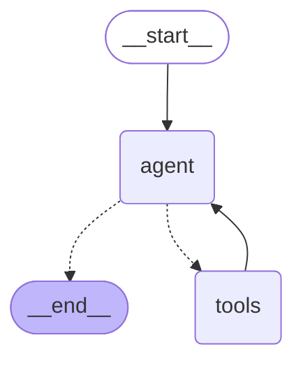
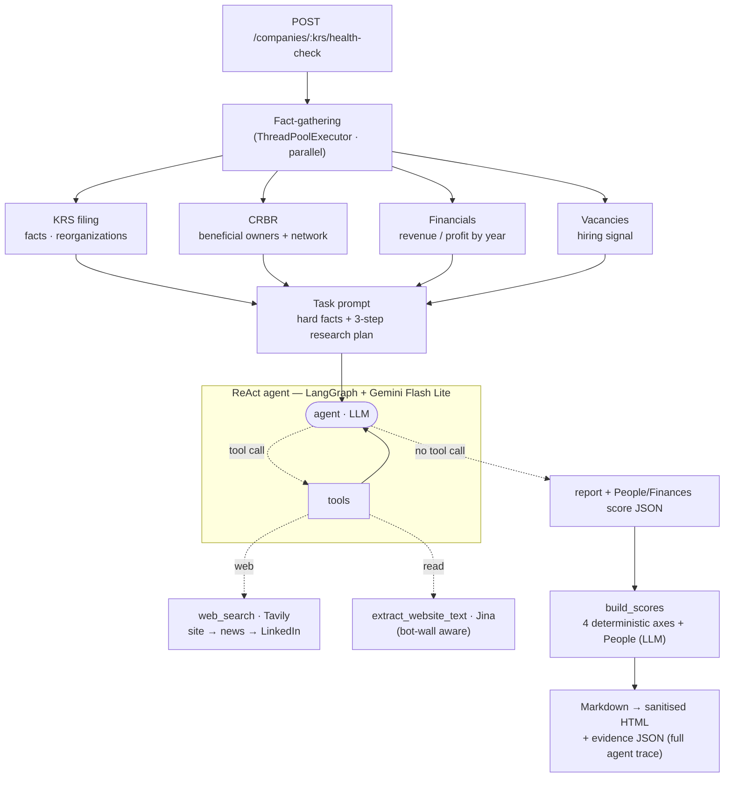

# Toxic Scanner

**Due-diligence for Polish companies — grounded in official registries, explained by an LLM.**

You type a company name (or NIP/KRS). The service resolves it to a real legal
entity, pulls hard facts from public Polish registries, gathers reputation
signals from the open web, and produces a verifiable financial-health &
reputation report — every score backed by a traceable line of evidence.

> Status: pre-alpha, single-developer project. It exists as much to be a
> **technology showcase** — a full product slice (async API, agentic LLM layer,
> containerisation, cloud deploy, cost/observability hardening) — as to solve
> the problem itself.

<p>
  
  
  
  
  
  
  
</p>

---

## Tech stack

The whole point of the project is breadth of a real production slice, not a
single LLM call.

| Layer | Technology |
| --- | --- |
| **Language / runtime** | Python 3.14 |
| **Web API** | FastAPI + Uvicorn (ASGI), fully async endpoints |
| **Validation / models** | Pydantic v2 |
| **AI & agents** | LangChain, LangGraph (`create_react_agent`), Google Gemini 3.1 Flash Lite |
| **Search & extraction** | Tavily Search API (raw-content mode), Jina Reader for clean page text |
| **Packaging** | `uv` with a frozen lockfile |
| **Container** | Docker (`python:3.14-slim`, `uv` layered from the official image) |
| **Cloud** | GCP Cloud Run (scale-to-zero), Artifact Registry, Secret Manager |
| **Observability** | Dual-sink telemetry — Cloud Logging + optional PostHog Cloud EU |
| **Frontend** | Vanilla JS, `marked` + `DOMPurify` (vendored, no CDN) |
| **Data sources** | Polish public registries: KRS, Ministry of Finance VAT whitelist, CRBR (beneficial owners) |

---

## Architecture

Not "one smart agent that browses the internet" — a set of plain data adapters
feeding a deterministic scoring core, with the LLM confined to the one thing
formulas can't do (reading employee sentiment).

```text
Browser UI  (vanilla JS · marked + DOMPurify)
     │
     ▼
FastAPI (async / ASGI) ── Rate limiter (per-IP + global daily caps)
     │                    Telemetry seam (Cloud Logging · PostHog)
     ▼
Company Resolver ── exact path:  KRS / NIP  ──────────────┐
     │              discovery:   web search → verify       │
     ▼                                                      ▼
Source Adapters                                     Official registries
  ├─ krs.py            National Court Register (facts: age, capital, filings, liquidation)
  ├─ vat_whitelist.py  Ministry of Finance VAT API
  ├─ crbr.py           Central Register of Beneficial Owners
  ├─ financials.py     Revenue / profit / equity / liabilities by year
  └─ web_search.py     Tavily discovery of candidate entities
     │
     ▼
Scoring (deterministic formulas)  +  ReAct agent (LangGraph + Gemini → reputation)
     │
     ▼
Evidence store (JSON)  +  Report renderer (Markdown → sanitised HTML)
```

### Request flow

1. `POST /companies/search` — resolve the query to up to five ranked legal
   entities (NIP/KRS is an exact hit; a name goes through web discovery +
   registry verification). The user confirms the right one.
2. `POST /companies/{krs}/health-check` — collect registry facts, financials
   and beneficial owners, run the reputation agent, compute the quality star,
   persist evidence, and render the report.

### Agent graph

The reputation step is a LangGraph `create_react_agent`, so LangGraph will hand
you the graph for free — `agent.get_graph().draw_mermaid()` prints the Mermaid
below (GitHub renders it live):



Out of the box that only captures the ReAct *mechanics* — the loop is identical
for any tool-calling agent. What makes *this* one specific is the two tools it
drives and the deterministic pipeline wrapped around it: the hard facts are
gathered **in parallel before** the agent runs and handed to it as ready
context (so it never re-guesses them), and its free-text output is scored by
**formula, not by the model**:



---

## Engineering highlights

These are the decisions worth reading the code for.

- **Grounded, explainable scoring.** The "quality star" has five axes; four are
  **deterministic formulas** over official data and one (*People*) is the LLM's
  job. When there's no data, an axis is `null` — an honest "no data", never a
  guessed 50/100. Every point awarded is a human-readable line in a `basis`
  list, so any score can be audited back to its source. See `app/scoring.py`.

- **Two-stage company resolution.** An exact identifier (KRS/NIP) takes a
  deterministic fast path with `confidence = 1.0`. A name goes through fuzzy
  discovery (Tavily) → **parallel verification against official registries**
  (`ThreadPoolExecutor`) → dedup → similarity-based confidence that is always
  `< 1.0`, forcing a human to confirm. Polish legal-form tokens
  (`sp. z o.o.`, `S.A.`, …) are stripped before name matching. See
  `app/companies.py`.

- **Defensive LLM tooling.** The reputation ReAct agent gets raw page bodies
  (not two-sentence snippets) and **detects bot walls** — a Cloudflare "just a
  moment" challenge served with HTTP 200 is reported to the model as "couldn't
  read", so it never mistakes a challenge page for "no reviews found". See
  `app/financial_health.py`.

- **Cost hardening on a public endpoint.** Report generation costs real money
  (Gemini + Tavily), so there are **two daily cost ceilings** — global and
  per-IP. The client IP is taken from the *right* of `X-Forwarded-For`
  (`TRUSTED_PROXY_HOPS`, tuned for direct Cloud Run) to close a trivial
  quota-bypass. See `app/ratelimit.py`.

- **Privacy-aware telemetry.** `distinct_id` is a salted hash of the IP (the
  target audience runs ad-blockers, so client-side JS would undercount).
  Product events carry **defense-in-depth PII redaction**; waitlist emails go to
  a separate sink, never into the product stream. See `app/telemetry.py`.

- **Supply-chain-conscious frontend.** No CDN. `marked` and `DOMPurify` are
  vendored, and DOMPurify sanitises the LLM/Markdown output before it reaches
  the DOM — untrusted model text is never injected raw.

- **Reproducible builds.** `uv sync --frozen` against a committed lockfile on a
  slim Python 3.14 base; a `/healthz` probe that touches no external services
  keeps Cloud Run cold-starts honest.

---

## Running locally

Requires [`uv`](https://docs.astral.sh/uv/) and API keys for Google Gemini and
Tavily.

```bash
# 1. Install dependencies from the lockfile
uv sync --frozen

# 2. Provide keys (LangChain reads these from the environment)
cat > .env <<'EOF'
GOOGLE_API_KEY=your-gemini-key
TAVILY_API_KEY=your-tavily-key
EOF

# 3. Run
uv run uvicorn app.main:app --reload --port 8080
```

Open <http://localhost:8080>. Reports and their evidence JSON are written to
`REPORTS_DIR` (default `reports/`).

### Notable environment variables

| Variable | Default | Purpose |
| --- | --- | --- |
| `GOOGLE_API_KEY` / `TAVILY_API_KEY` | — | LLM and web-search credentials |
| `LANGSMITH_TRACING` / `LANGSMITH_API_KEY` | `false` / — | Agent observability: per-run ReAct trace, tool calls, tokens |
| `RATE_LIMIT_GLOBAL_PER_DAY` | `50` | Hard daily ceiling on report builds |
| `RATE_LIMIT_IP_PER_DAY` | `10` | Per-IP daily ceiling |
| `TRUSTED_PROXY_HOPS` | `0` | Trusted proxy hops right of the client IP in `X-Forwarded-For` |
| `POSTHOG_API_KEY` | — | Enables server-side PostHog capture (off → no-op) |
| `REPORTS_DIR` | `reports` | Where reports and evidence JSON are stored |

---

## Deployment

Built for **GCP Cloud Run** with `min-instances=0` (scales to zero → effectively
free at validation traffic; single instance is enough for the in-memory rate
limiter). Container images live in **Artifact Registry**; API keys come from
**Secret Manager**.

```bash
docker build -t toxic-scanner .
docker run -p 8080:8080 --env-file .env toxic-scanner
```

---

## Roadmap

Deliberately honest about what is **not** built yet:

- **Infrastructure as Code** — Terraform to deploy the Cloud Run service,
  registry and secrets in one reproducible command *(planned, not yet in repo)*.
- **CI** — GitHub Actions running lint + unit tests on the pure functions
  (scoring formulas, NIP checksum, registry parsers).
- **Primary financial source** — parse annual statements straight from the
  Repozytorium Dokumentów Finansowych (XML) instead of secondary web sources.
- **Persistence** — report history in a database, a task queue for long
  analyses, and PDF export.

---

## Legal & ethical constraints

- No logging into third-party sites on a user's behalf; no CAPTCHA bypass.
- No scraping of private data; no aggressive mass scraping.
- Rate limits and caching on every outbound call.
- Protected sources are used only where data is publicly available, or skipped.

---

*Single-developer portfolio project. Not affiliated with any of the registries
or data sources referenced above.*
